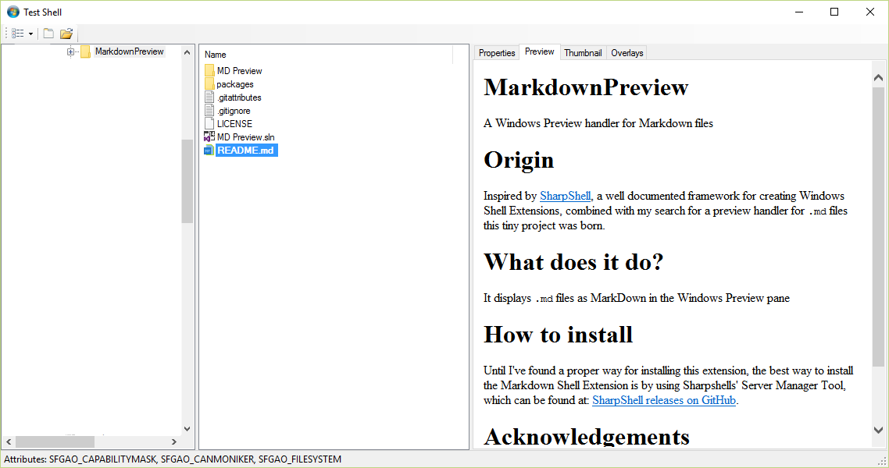

# MarkdownPreview #
A Windows Preview handler for Markdown files

# Origin #
Inspired by [SharpShell](https://sharpshell.codeplex.com/ "Sharpshell"), a well documented framework for creating Windows Shell Extensions, combined with my search for a preview handler for `.md` files this tiny project was born.

# What does it do? #
It displays `.md` files as MarkDown in the Windows Preview pane 

# How to install #
Download the latest release from [MarkdownPreview releases on GitHub](https://github.com/Atrejoe/MarkdownPreview/releases "MarkdownPreview on GitHub").

Until I've found a proper way for creating an installer for this extension, the best way to install the Markdown Shell Extension is by using Sharpshells' Server Manager Tool, which can be found at:  [SharpShell releases on GitHub](https://github.com/dwmkerr/sharpshell/releases "SharpShell releases").

# Acknowledgements #
Next to SharpShell, special thanks also go out to [Kiri-rin (author of MarkdownSharp)](https://github.com/Kiri-rin/markdownsharp "Kiri-rin"), who had a lightning response when [I requested a signed version of Markdownsharp](https://github.com/Kiri-rin/markdownsharp/issues/71). 

# Screenshot #

*Sample preview (taken in Windows Explorer in Windows 10)*
