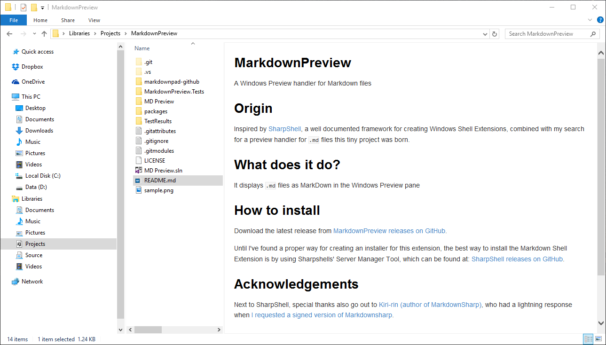

> # Maintenance warning, alternative suggestion	
> Since [v.0.16.0](https://github.com/microsoft/PowerToys/releases/tag/v0.16.0) MS Powertoys can perform the same task.
> Given that my setup is buggy and poorly supported, I recommend using MS Powertoys.
>
> It was fun to develop this tool, less fun debugging it.
>
> Thanks [@Aaltuj](https://github.com/Aaltuj) for the heads up

# MarkdownPreview #
A Windows Explorer preview pane handler for Markdown files

# Origin #
Inspired by [SharpShell](https://sharpshell.codeplex.com/ "Sharpshell"), a well documented framework for creating Windows Shell Extensions, combined with my search for a preview handler for `.md` files this tiny project was born.

# What does it do? #
It displays `.md` files as MarkDown in the Windows Explorer preview pane 

# How to install #
Download and run the latest installer from [MarkdownPreview releases on GitHub](https://github.com/Atrejoe/MarkdownPreview/releases "MarkdownPreview on GitHub").

# Acknowledgements #
Next to [SharpShell](https://github.com/dwmkerr/sharpshell), this project uses [MarkDig](https://github.com/lunet-io/markdig) styled by [MarkdownPad CSS](https://github.com/nicolashery/markdownpad-github).

# Screenshot #

*Sample preview (taken in Windows Explorer in Windows 10)*
